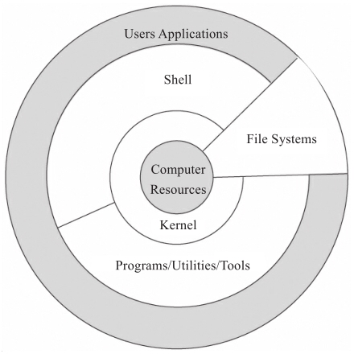

# Shell 基础

## 1. 什么是shell？

> Shell 既是一种脚本编程语言，也是一个连接内核和用户的软件。

在计算机语言中，Shell是指一种命令行解释器，是为用户和操作系统之间通信提供的一种接口（想象一下，如果没有一种与计算机沟通的方式，那么计算机如何得到来自人脑的指令呢），它接受来自用户输入的命令，并将其转换为一系列的系统调用送到内核执行，并将结果输出给用户。如图显示了Shell在操作系统中的当一台系统运行起来时，内核（kernel）会被调入内存中运行，由内核执行所有底层的工作，它会将所有应用程序及用户的操作翻译成CPU的基本指令，并将其送至处理器。这些过程听起来非常复杂，而且实际上也确实是非常底层和技术化的。为了对用户屏蔽这些复杂的技术细节，同时也是为了保护内核不会因用户直接操作而受到损害，有必要在内核之上创建一个层，该层就是一个“壳”，也就是Shell名称的由来。



shell将内核、程序和用户连接起来。

**shell是一种脚本语言**，解释型语言

## 2. 常用的shell有哪些？

常见的 Shell 有 sh、bash、csh、tcsh、ash 等。

### 查看Shell

Shell 是一个程序，一般都是放在/bin或者/user/bin目录下，当前系统可用的 Shell 都记录在/etc/shells文件中。/etc/shells是一个纯文本文件，你可以在图形界面下打开它，也可以使用 `cat` 命令查看它。

```bash
~ cat /etc/shells
# List of acceptable shells for chpass(1).
# Ftpd will not allow users to connect who are not using
# one of these shells.

/bin/bash
/bin/csh
/bin/ksh
/bin/sh
/bin/tcsh
/bin/zsh
➜  ~ echo $SHELL
```

### 查看默认shell

如果你希望查看当前 Linux 的默认 Shell，那么可以输出 SHELL 环境变量：

```bash
$ echo $SHELL
/bin/zch
```

## 3. 第一个shell脚本

打开文本编辑器，新建一个文本文件，并命名为`helloworld.sh`,输入代码：

```bash
#!/bin/bash
echo "Hello World !"  #这是一条语句
```

第一行 `!#` 是一个约定的标记，告诉系统这个脚本需要什么解释器来执行，后面的`/bin/bash`表示解释器的位置

第二行`echo` 命名向标准输出文件输出文本（一般指的是终端）

`#` 表示注释

### 4. 执行脚本

#### 作为可执行程序

- 指定脚本的路径执行

    ```bash
    cd demo  #切换到 helloworld.sh 所在的目录
    chmod +x ./test.sh  #使脚本具有执行权限
    ./helloworld.sh  #执行脚本
    ```

    通过这种方式运行脚本，第一行一定要指定使用哪种解释器

- 直接运行脚本执行

    使用这种方式运行脚本可以不指定脚本的目录，但是脚本所在的目录一定要在环境变量`PATH`中,使用这种方式运行脚本也需要添加执行权限

- 使用 `.`

    点号可以用来执行某个脚本，甚至没有执行权限也可以运行。

    ```bash
    . ./helloWorld.sh
    ```

- 使用`source`命令

    与点号类似，`source` 命令也可读取并在当前环境中执行脚本，同时还可返回脚本中最后一个命令的返回状态；如果没有返回值则返回 0，代表执行成功；如果未找到指定的脚本则返回 false。

    ```bash
    source ./helloWorld.sh
    ```

#### 作为解释器的参数

这种方式是直接运行解释器，参数是脚本的文件名。

```bash
/bin/bash helloWorld.sh
```

## 5. Shell变量

在 Bash shell 中，每一个变量的值都是字符串，无论你给变量赋值时有没有使用引号，值都会以字符串的形式存储。

这意味着，Bash shell 在默认情况下不会区分变量类型，即使你将整数和小数赋值给变量，它们也会被视为字符串，这一点和大部分的编程语言不同。

### 定义变量

Shell 支持以下三种定义变量的方式：

```bash
variable=value
variable='value'
variable="value"
```

variable 是变量名，value 是赋给变量的值。如果 value 不包含任何空白符（例如空格、Tab 缩进等），那么可以不使用引号；如果 value 包含了空白符，那么就必须使用引号包围起来。使用单引号和使用双引号也是有区别的，稍后我们会详细说明。

**注意，赋值号=的周围不能有空格，这可能和你熟悉的大部分编程语言都不一样。**

### 使用变量

使用一个定义过的变量，只要在变量名前加`$`即可，如：

```bash
name=lee
echo $name
echo ${name}
```

变量名后面的`{}`是可选的，加不加都行，加花括号是为了帮助解释器识别变量的边界，比如下面这张情况：

```bash
skill="Java"
echo "I am good at ${skill}Script"
```

### 修改变量的值

```bash
name="lee"
echo ${name}
name=“Jack”
echo ${name}
```

### 单引号和双引号的区别

先来看一个列子:

```bash
#!/bin/bash

name="jack"
echo 'my name is ${name}'
echo "my name is ${name}"
```

运行结果：

```bash
my name is ${name}
my name is jack
```

以单引号' '包围变量的值时，单引号里面是什么就输出什么，即使内容中有变量和命令（命令需要反引起来）也会把它们原样输出。这种方式比较适合定义显示纯字符串的情况，即不希望解析变量、命令等的场景。

以双引号" "包围变量的值时，输出时会先解析里面的变量和命令，而不是把双引号中的变量名和命令原样输出。这种方式比较适合字符串中附带有变量和命令并且想将其解析后再输出的变量定义。

### 只读变量

创建只读变量有两种方式

- declare -r
- readonly

### 删除变量 unset

```bash
var1='test'
echo $var1
unset var1
echo $var1
```

运行结果

```bash
test
```

### 变量的作用域

Shell变量的作用域可以分为三种：

- 全局变量：只能在当前Shell中使用
- 局部变量：只在函数内部使用
- 环境变量：能在当前Shell和其子Shell中使用

#### 全局变量

所谓全局变量，就是指变量在当前的整个 Shell 会话中都有效。每个 Shell 会话都有自己的作用域，彼此之间互不影响。

需要强调的是，全局变量的作用范围是当前的 Shell 会话，而不是当前的 Shell 脚本文件，它们是不同的概念。打开一个 Shell 窗口就创建了一个 Shell 会话，打开多个 Shell 窗口就创建了多个 Shell 会话，每个 Shell 会话都是独立的进程，拥有不同的进程 ID。在一个 Shell 会话中，可以执行多个 Shell 脚本文件，此时全局变量在这些脚本文件中都有效。

例如现在编写两个脚本分别为a.sh 和 b.sh的代码如下：

a.sh

```bash
#!/bin/bash
echo $a
b=200
```

b.sh

```bash
#!/bin/bash
echo $b
```

在终端中输入如下命令：

```bash
$ a=99
$ . ./a.sh
99
$ . b.sh
200
$
```

从输出结果可以发现，在 Shell 会话中以命令行的形式定义的变量 a，在 a.sh 中有效；在 a.sh 中定义的变量 b，在 b.sh 中也有效。

#### 局部变量

```bash
#!/bin/bash
#定义函数
function func(){
    a=99
}
#调用函数
func
#输出函数内部的变量
echo $a
```

输出结果：

```bash
99
```

a 是在函数内部定义的，但是在函数外部也可以得到它的值，证明它的作用域是全局的，而不是仅限于函数内部。

要想变量的作用域仅限于函数内部，那么可以在定义时加上local命令，此时该变量就成了局部变量。请看下面的代码：

```bash
#!/bin/bash
#定义函数
function func(){
  local a=99
}
#调用函数
func
#输出函数内部的变量
echo $a
```

### 环境变量

全局变量只在当前 Shell 会话中有效，如果使用`export`命令将它导出，那么它就在所有的子 Shell 中也有效了，这称为“环境变量”。

环境变量被创建时所处的 Shell 被称为父 Shell，如果在父 Shell 中再创建一个 Shell，则该 Shell 被称作子 Shell。当子 Shell 产生时，它会继承父 Shell 的环境变量为自己所用，所以说环境变量可从父 Shell 传给子 Shell。不难理解，环境变量还可以传递给孙 Shell。

**注意，环境变量只能向下传递而不能向上传递，即“传子不传父”。**

```bash
$ a=22       #定义一个全局变量
$ echo $a    #在当前Shell中输出a，成功
22
$ bash       #进入子Shell
$ echo $a    #在子Shell中输出a，失败

$ exit       #退出子Shell
exit
$ export a   #将a导出为环境变量
$ bash       #重新进入子Shell
$ echo $a    #在子Shell中再次输出a，成功
22
$ exit       #退出子Shell
exit
$ exit       #退出父Shell，结束整个Shell会话
```

可以发现，默认情况下，a 在子 Shell 中是无效的；使用 `export` 将 a 导出为环境变量后，在子 Shell 中就可以使用了。

此外，通过`export`命令导出的环境变量是临时的，关闭 Shell 会话后它就销毁了。所以，这种环境变量也只是在局部范围内起作用，并不影响所有 Shell。

## 位置参数

运行 Shell 脚本文件时我们可以给它传递一些参数，这些参数在脚本文件内部可以使用`$n`的形式来接收，例如，`$1` 表示第一个参数，`$2` 表示第二个参数，依次类推。

- 给脚本文件传递参数

    编写如下代码：

    ```bash
    #!/bin/bash
    echo "param1: $1"
    echo "param2: $2"
    ```

- 给函数传递位置参数

    ```bash
    #!/bin/bash
    #定义函数
    function func(){
        echo "param1: $1"
        echo "param2: $2"
    }
    #调用函数
    func p1 p2
    ```

## 特殊变量

| 变量 | 含义 |
|:--- |:--- |
| `$0` | 当前脚本的文件名。
| `$n`（n≥1） | 传递给脚本或函数的参数。n 是一个数字，表示第几个参数。例如，第一个参数是 `$1`，第二个参数是 `$2`。
| `$#` | 传递给脚本或函数的参数个数。
| `$*` | 传递给脚本或函数的所有参数。
| `$@` | 传递给脚本或函数的所有参数。当被双引号" "包含时，`$@` 与 `$*` 稍有不同
| `$?` | 上个命令的退出状态，或函数的返回值
| `$$` | 当前 Shell 进程 ID。对于 Shell 脚本，就是这些脚本所在的进程 ID。

*和@的区别

当 `$*` 和 `$@` 不被双引号`" "`包围时，它们之间没有任何区别，都是将接收到的每个参数看做一份数据，彼此之间以空格来分隔。

但是当它们被双引号`" "`包含时，就会有区别了：

- `"$*"` 会将所有的参数从整体上看做一份数据，而不是把每个参数都看做一份数据。
- `"$@"` 仍然将每个参数都看作一份数据，彼此之间是独立的。

```bash
#!/bin/bash
echo "print each param from \"\$*\""
for var in "$*"
do
    echo "$var"
done
echo "print each param from \"\$@\""
for var in "$@"
do
    echo "$var"
done
```

运行结果：

```bash
print each param from "$*"
a b c d
print each param from "$@"
a
b
c
d
```

从运行结果可以发现，对于"*"，只循环了 1 次，因为它只有 1 分数据；对于"@"，循环了 5 次，因为它有 5 份数据。

### `$?` 获取上一个命令的退出状态

所谓退出状态，就是上一个命令执行后的返回结果。退出状态是一个数字，一般情况下，大部分命令执行成功会返回 0，失败返回 1，这和C语言的 main() 函数是类似的。

## 字符串

字符串（String）就是一系列字符的组合。字符串是 Shell 编程中最常用的数据类型之一

- 获取字符串长度 `${#string_name}`
- 字符串拼接

```bash
#!/bin/bash
name="Shell"
url="www.baidu.com"
str1=$name$url  #中间不能有空格
str2="$name $url"  #如果被双引号包围，那么中间可以有空格
str3=$name": "$url  #中间可以出现别的字符串
str4="$name: $url"  #这样写也可以
str5="${name}Script: ${url}index.html"  #这个时候需要给变量名加上大括号
echo $str1
echo $str2
echo $str3
echo $str4
echo $str5
```

## 数组

和其他编程语言一样，Shell 也支持数组。数组（Array）是若干数据的集合，其中的每一份数据都称为元素（Element）。

Shell 并且没有限制数组的大小，理论上可以存放无限量的数据。和C语言类似，Shell 数组元素的下标也是从 0 开始计数。

获取数组中的元素要使用下标[ ]，下标可以是一个整数，也可以是一个结果为整数的表达式；当然，下标必须大于等于 0。

遗憾的是，常用的 Bash Shell 只支持一维数组，不支持多维数组。

### 定义数组

在 Shell 中，用括号( )来表示数组，数组元素之间用空格来分隔。由此，定义数组的一般形式为：

```bash
array_name=(ele1  ele2  ele3 ... elen)
```

定义一个数组实例：

定义一个包含不同类型的数组：

shell数组长度是不固定的，定义之后可以增加元素

### 获取数组的元素

获取数组元素的值，一般使用下面的格式：

```bash
${array_name[index]}
```

其中`array_name`是数组名`index`是下标。

使用 `@` 和 `*` 获取素组中所有的元素。

### 获取数组的长度

利用`@`或`*`，可以将数组扩展成列表，然后使用#来获取数组元素的个数，格式如下：

```bash
${#array_name[@]}
${#array_name[*]}
```

### 数组拼接

所谓 Shell 数组拼接（数组合并），就是将两个数组连接成一个数组。

拼接数组的思路是：先利用`@`或`*`

将数组扩展成列表，然后再合并到一起。具体格式如下：

```bash
array_new=(${array1[@]}  ${array2[@]})
array_new=(${array1[*]}  ${array2[*]})
```

### Shell删除数组元素（也可以删除整个数组）

在 Shell 中，使用 unset 关键字来删除数组元素，具体格式如下：

```bash
unset array_name[index]
```

其中`array_name`表示数组名， `index`表示数组下标

删除整个数组

```bash
unset array_name
```

## if else

if 语句

最简单的用法就是只使用 if 语句，它的语法格式为：

```bash
if  condition
then
    statement(s)
fi
```

### if else 语句

如果有两个分支，就可以使用 if else 语句，它的格式为：

```bash
if  condition
then
    statement1
else
    statement2
fi
```

### if elif else 语句

Shell 支持任意数目的分支，当分支比较多时，可以使用 if elif else 结构，它的格式为：

```bash
if  condition1
then
    statement1
elif condition2
then
    statement2
elif condition3
then
    statement3
……
else
    statementn
fi
```

## for 循环

Shell for 循环有两种使用形式，下面我们逐一讲解。

- C语言风格的 for 循环的用法如下：

    ```bash
    for((exp1; exp2; exp3))
    do
        statements
    done
    ```

- Python 风格的 for in 循环Python 风格的 for in 循环

    ```bash
    for variable in value_list
    do
        statements
    done
    ```

参考：

- https://www.learnshell.org/
- https://www.shellscript.sh/
- http://linuxcommand.org/lc3_learning_the_shell.php
- [shell-scripting-tutorial](https://github.com/techtutorials/shell-scripting-tutorial)
- [learn-shell](https://github.com/yifengyou/learn-shell)
- [shell-tutorial](https://github.com/jaywcjlove/shell-tutorial)
